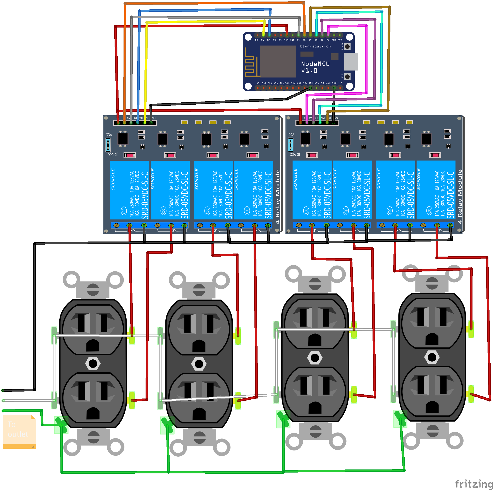

# Powerbox

Eight individual MQTT controlled AC outlets via "Lolin" ESP8266

## Parts:
1. Lolin "NodeMCU" V3
1. SainSmart 8 Channel Relay board
1. Weatherproof Enclosure
1. 4-Outlet Cover x2
1. Oulets x4

## Configuration:

1. After flashing the ESP8266 with *powerbox.ino* connect via WiFi to the SSID "powerbox-setup"
1. Browse to *192.168.4.1*
1. Fill in the SSID, MQTT Server, and MQTT Topics fields (or use the defaults)
1. To reset, hold down the *flash* botton for 10 seconds (Onboard LED will flash 3 times)

## Wiring:

